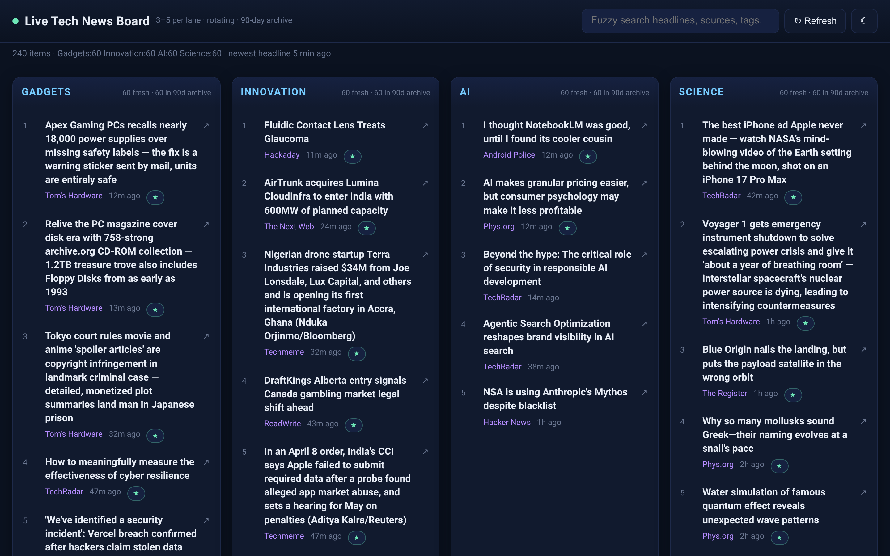
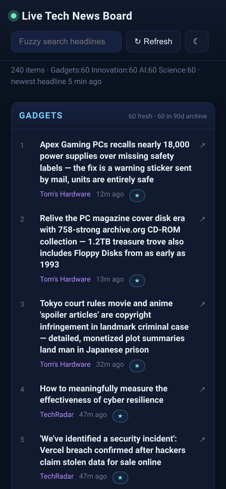
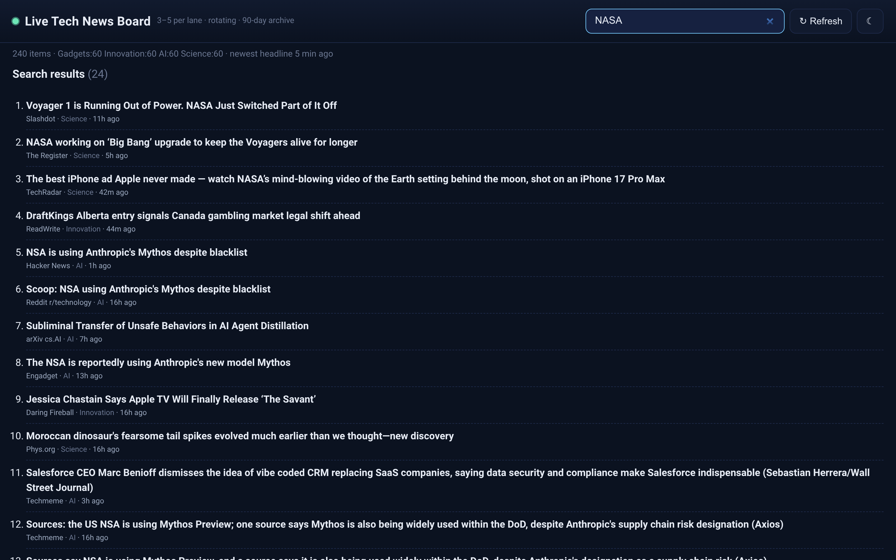
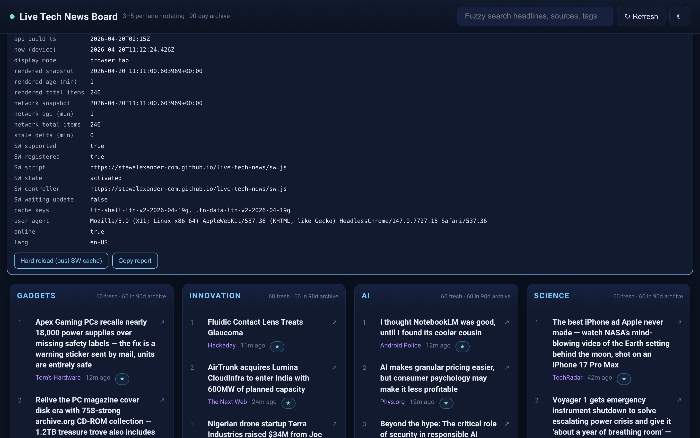

# live-tech-news

<p align="center">
  
</p>

<p align="center">
  <strong>Live, editorial-grade tech news board.</strong><br/>
  Rotating headlines across <em>Gadgets · Innovation · AI · Science</em>, auto-refreshed every few minutes, fuzzy-searchable, installable as a PWA.
</p>

<p align="center">
  <a href="https://stewalexander-com.github.io/live-tech-news/"><strong>Live site →</strong></a>
  &middot;
  <a href="https://github.com/StewAlexander-com/live-tech-news/actions/workflows/refresh-news.yml">Refresh status</a>
  &middot;
  <a href="#install-as-a-pwa">Install as PWA</a>
</p>

---

## What it looks like

### Desktop board

Four lanes, newest on top, source + age on every card, paywall and high-impact pills, fuzzy search across the full 90-day archive.



### Mobile / installed PWA

Single-column responsive layout, large tap targets, identical data, works offline against the last snapshot. Installs to the iOS/Android home screen with a flat newspaper-fold icon.

<p align="center">
  
</p>

### Fuzzy search across the 90-day archive

Type anything (`NASA`, `Voyager`, `Mythos`, `CD-ROM`) — Fuse.js runs over every retained item across all lanes, not just what's on screen.



### Hidden diagnostics (triple-tap the brand)

Triple-tap the green dot in the header to reveal a full health panel: app build, render-vs-network snapshot ages, stale delta, service worker state, cache keys, and a one-tap copy-report button. Used to debug stuck PWAs in the wild.



---

## TL;DR architecture

- **Static frontend** — `index.html` + vanilla JS + Fuse.js. No build step.
- **Single source of truth** — `data/news.json`. The browser polls it every 5 min.
- **Aggregator + reviewer** — `scripts/update_news.py` pulls ~31 RSS sources plus the Hacker News Algolia API, classifies into the four lanes, applies an editorial blocklist (puzzle filler, deals listicles, reviewer-bait), fuzzy-dedupes near-duplicate stories across outlets, caps any single source from dominating a lane, ranks with an impact / less-circulated bias, and rewrites `data/news.json`.
- **Self-healing CI** — `.github/workflows/refresh-news.yml` runs three overlapping `*/5` crons (GitHub drops runs under load), commits the updated snapshot, and deploys Pages in the same job. Includes rebase-and-replay on push conflicts.
- **PWA** — `manifest.webmanifest` + `sw.js` (network-first for shell, cache-first for icons) + `SKIP_WAITING` so updates land on the next tab focus instead of getting stuck.

```
live-tech-news/
├── index.html                # the dashboard + diag panel markup
├── assets/
│   ├── css/style.css         # dark/light theme, responsive grid
│   ├── js/app.js             # rendering, rotation, polling, search, diag, recovery banner
│   ├── icons/                # PWA icons (svg + rendered pngs)
│   └── screenshots/          # what you see above
├── data/
│   └── news.json             # snapshot written by the ingestor
├── scripts/
│   ├── update_news.py        # ingestion + filtering + dedup + ranking + FILO merge
│   └── requirements.txt      # feedparser
├── manifest.webmanifest      # PWA manifest
├── sw.js                     # service worker (network-first shell)
└── .github/workflows/
    ├── refresh-news.yml      # cron → ingest → commit → deploy Pages (self-healing)
    └── pages.yml             # standard Pages deploy (manual fallback)
```

## Editorial filtering

This is an aggregator **and reviewer**, not a raw RSS dump. The ingestor explicitly drops:

- NYT puzzle filler (Connections / Strands / Wordle / Spelling Bee).
- "Best deals", "X under $50", and gift-guide listicles.
- Shopping roundups and affiliate review-bait ("I tested X for Y days").
- Horoscopes, streaming recaps, recipe content, sports schedules.

It also:

- **Fuzzy-dedupes** near-duplicate titles across outlets via Jaccard similarity (≥ 0.55) and collapses them to the highest-ranked instance.
- **Caps** any single source at 6 items per lane so one chatty feed can't dominate.
- **Boosts** stories with 3+ outlet coverage to `impact: high`.
- **Routes** Apple/iOS rumor posts into Innovation rather than Gadgets unless they're concretely about hardware.
- **Retroactively purges** items that match a newly added blocklist rule on the next run.

### Lane queue model (FILO)

Each lane is a bounded queue, default cap **60** (override with `LTN_LANE_CAP`).

1. Fetch + classify + dedupe fresh items.
2. Front-insert new items, keep existing items.
3. Re-sort by publish time, newest first.
4. Prune anything older than `LTN_RETAIN_DAYS` (default 90).
5. Truncate the tail when the lane exceeds `LTN_LANE_CAP`.

The browser shows 5 visible items per lane and rotates through the retained archive on a timer; the full 90 days remains fuzzy-searchable.

### Ranking

`rank(item) = recency × source_trust × circulation × impact × paywall × cue`

- `recency` — exponential decay, ~36-hour half-life.
- `source_trust` — per-outlet weight; research/niche outlets boosted.
- `circulation` — mainstream domains penalized ~12% (less-circulated bias).
- `impact` — `+25%` for HN ≥ 150 points or top-quartile in lane, plus the multi-outlet coverage boost above.
- `paywall` — `−25%`. Still allowed through so globally important paywalled stories aren't lost.
- `cue` — `+8%` for science items with a hardware/software/engineering angle.

## Sources (default)

Roster inspired by [techurls.com](https://techurls.com/) plus extra research/niche outlets:

- **Gadgets:** Ars Technica, The Verge, Engadget, Tom's Hardware, Liliputing, CNET, TechRadar, Mac Rumors, Android Police.
- **Innovation:** MIT Tech Review, Hackaday, IEEE Spectrum, TechCrunch, The Register, The Next Web, ReadWrite, MakeUseOf, Techmeme, Daring Fireball, Slashdot, Reddit r/technology.
- **AI:** Ars Technica AI, MIT Tech Review AI, arXiv cs.AI, arXiv cs.LG.
- **Science (tech-bent):** Ars Technica Science, Quanta Magazine, Phys.org, ScienceDaily Engineering, Nature.
- **Cross-lane signal:** Hacker News front page via the Algolia API, classified into the appropriate lane per item.

Set `NEWSAPI_KEY` (repo secret) to add NewsAPI as an extra source.

## Freshness

End-to-end latency from publish to your screen:

- Outlet → their RSS feed: **10–30 min** (most outlets), longer for slow regenerators.
- RSS → `data/news.json`: **≤ 5 min** (three overlapping crons).
- Commit → Pages deploy: **~20 s**.
- Browser poll cadence: **5 min**.

So newest-headline age is typically **~10 min p50, ~25 min p95**, almost entirely bounded by upstream RSS regeneration cadence rather than this pipeline.

## Install as a PWA

- **iOS / Safari** — open the [live site](https://stewalexander-com.github.io/live-tech-news/), tap **Share → Add to Home Screen**.
- **Android / Chrome / Edge** — tap the **Install** prompt in the footer or the address-bar install icon.

The service worker caches the app shell and Fuse.js for offline use and falls back to the last-known `data/news.json` when the network is down. The shell is served **network-first** so updates land on the next tab focus instead of getting stuck on an old build.

If the PWA ever shows a stuck shell, the site shows a red recovery banner with a one-tap **Clear cache & reload**. There's also a hidden diagnostic panel — triple-tap the green brand dot in the header.

## Local development

```bash
# one-time
pip install -r scripts/requirements.txt

# regenerate the data snapshot against live sources
python scripts/update_news.py

# serve locally — then open http://127.0.0.1:8765
python -m http.server 8765
```

## Deploy your own

1. Create an empty repo on GitHub called `live-tech-news`.
2. From inside this folder:

   ```bash
   git init -b main
   git add .
   git commit -m "chore: initial live-tech-news import"
   git remote add origin https://github.com/YOURNAME/live-tech-news.git
   git push -u origin main
   ```

3. In your repo settings on github.com:
   - **Settings → Pages → Build and deployment → Source: "GitHub Actions".**
   - **Settings → Actions → General → Workflow permissions → Read and write permissions** (so the refresh workflow can commit `data/news.json` back).
   - (Optional) **Settings → Secrets → `NEWSAPI_KEY`** to enable NewsAPI ingestion.

The first refresh run publishes a fresh `data/news.json` and deploys Pages in the same job.

## Manual refresh

- In GitHub: **Actions → Refresh news → Run workflow**.
- Locally: `python scripts/update_news.py && git add data/news.json && git commit -m "chore(data): refresh" && git push`

## Tuning

| env var            | default | purpose                                  |
|--------------------|---------|------------------------------------------|
| `LTN_LANE_CAP`     | `60`    | Max items retained per lane              |
| `LTN_RETAIN_DAYS`  | `90`    | Archive retention window                 |
| `LTN_REPO_URL`     | —       | Shown in the footer "View repo" link     |
| `NEWSAPI_KEY`      | —       | Enable NewsAPI ingestion                 |

In `assets/js/app.js`:

- `VISIBLE_PER_LANE` — items on screen per lane (default 5).
- `ROTATION_MS` — per-lane rotation cadence (default 5 min).
- `LANE_STAGGER_MS` — offset between lanes (default 75 sec × lane index).
- `POLL_MS` — how often the UI re-fetches `news.json` (default 5 min).

## License

MIT. Do what you like.
